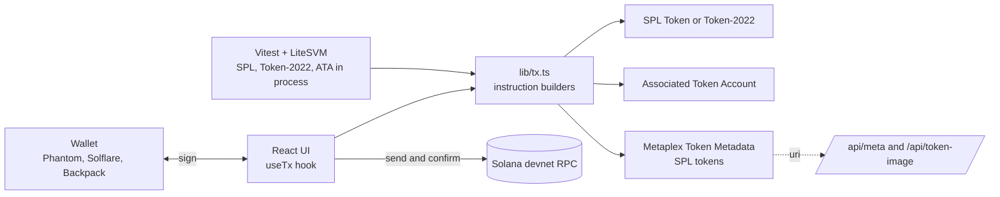

# TokenForge: create Solana tokens on devnet

[](https://github.com/Waleed-Ilyas/tokenforge/actions/workflows/ci.yml)


Create an SPL or Token-2022 token with a name, symbol and supply in a single transaction, then mint more or send it to anyone. Connect Phantom, Solflare or Backpack.

**Live demo:** LIVE_URL · **Personal project.** Devnet only: the tokens have no value and nothing here sends a mainnet transaction.

## Demo accounts

There are no accounts. Connect any wallet set to devnet and use the **Airdrop 1 devnet SOL** button (or [faucet.solana.com](https://faucet.solana.com) if the public faucet is rate limited).

## Program IDs (devnet)

| Program                                   | Address                                        |
| ----------------------------------------- | ---------------------------------------------- |
| SPL Token                                 | `TokenkegQfeZyiNwAJbNbGKPFXCWuBvf9Ss623VQ5DA`  |
| Token-2022                                | `TokenzQdBNbLqP5VEhdkAS6EPFLC1PHnBqCXEpPxuEb`  |
| Associated Token Account                  | `ATokenGPvbdGVxr1b2hvZbsiqW5xWH25efTNsLJA8knL` |
| Metaplex Token Metadata (SPL tokens only) | `metaqbxxUerdq28cj1RbAWkYQm3ybzjb6a8bt518x1s`  |

TokenForge deploys no program of its own. It composes these audited programs.

## Features

- **One-transaction launch:** create the mint, attach metadata, create your token account and mint the supply, all atomically. If any step fails, nothing is created.
- **Two standards:** classic SPL Token with Metaplex metadata, or Token-2022 with the metadata stored on the mint itself (metadata-pointer and token-metadata extensions).
- **Fixed supply option:** give up the mint authority right after minting, so nobody can ever create more.
- **My tokens:** everything the wallet holds, with names and symbols resolved, a copyable mint address and an explorer link. **Send** creates the recipient's token account when needed. **Mint more** only appears when you are the mint authority.
- **Metadata without uploads:** the app serves the Metaplex JSON and a generated SVG badge itself (`/api/meta`, `/api/token-image`), so there is no database and no file upload. Custom images are accepted as https links.
- **Exact amounts:** supply and transfer amounts are parsed with string arithmetic into `bigint` base units. No floating point, decimals and u64 limits enforced.
- **Devnet tooling:** devnet banner, one-click airdrop, explorer links on every transaction and mint.
- **Clear errors:** wallet rejection, insufficient SOL, rate limits and expiry each get a plain-language message. Validation is shown next to the field that is wrong.

## Tech stack

Next.js 15 (App Router), TypeScript strict, Tailwind CSS v4, `@solana/web3.js`, `@solana/spl-token`, `@solana/spl-token-metadata`, `@metaplex-foundation/mpl-token-metadata` (2.13), `@solana/wallet-adapter`, Zod, Vitest, LiteSVM, ESLint, Prettier, GitHub Actions.

## Architecture



`lib/tx.ts` only builds instructions. The browser signs them with the wallet, the tests sign them with a keypair, so the exact code that ships is the code that is tested.

## Getting started

```bash
git clone https://github.com/Waleed-Ilyas/tokenforge.git && cd tokenforge
pnpm install
cp .env.example .env.local   # optional
pnpm dev                     # http://localhost:3000
```

Set `NEXT_PUBLIC_SOLANA_RPC` to a Helius or other devnet endpoint if the public one rate limits you.

## Tests

```bash
pnpm test              # unit tests, plus the LiteSVM suite on Linux and macOS
pnpm lint && pnpm typecheck
```

- **Unit tests** cover amount parsing (exactness, u64, decimals), form validation, the metadata link limit, and the shape of every transaction the builders produce.
- **Integration tests (LiteSVM)** execute the builders against the real SPL Token, Token-2022 and Associated Token programs in an in-process Solana VM and check the resulting on-chain state: mint decimals and supply, authority revoked for fixed supply, the Token-2022 metadata-pointer and token-metadata extension contents, minting more, transfers to a wallet with no token account, and rejection of over-balance and wrong-decimals transfers.
- **Not covered by the VM:** the Metaplex Token Metadata program. LiteSVM aborts (SIGABRT) when it executes the deployed program binary, on both 0.5.0 and 0.8.0, so for SPL tokens that instruction is removed before sending and checked structurally instead (program id, metadata PDA, mint account, instruction discriminator, name and symbol bytes). Whether Metaplex accepts it on devnet is therefore not verified here.
- **Each scenario runs in its own Node process** (`tests/support/scenarios.ts`, launched by `tests/onchain.test.ts`), and the test passes when the script prints its `PASS` marker after every assertion held. This is a workaround: LiteSVM's native code aborts with `std::bad_alloc` when the process shuts down, and around the third transaction if several VMs share a process (reproduced on Linux with litesvm 0.5.0 and 0.8.0). The abort comes after the assertions ran, so the exit code is ignored and a failed assertion, which throws before the marker, still fails the test.
- LiteSVM ships native binaries for Linux and macOS only, so on Windows that suite is skipped automatically. GitHub Actions runs it on every push.

## Key engineering decisions

- **Builders separate from signing.** The same instruction code runs in the browser and in tests.
- **Rent is computed per standard.** Token-2022 pays for its metadata up front because writing metadata grows the mint account, so `mintRent` sizes the account from the extension layout.
- **Atomic creation.** One transaction, so there are no half-created tokens to clean up.
- **`createAssociatedTokenAccountIdempotent` everywhere,** so minting and sending never fail because an account already exists.
- **Metadata URI has a hard 200-character limit.** Instead of truncating silently, the form says how many characters it needs and what to shorten.
- **Whitelisted inputs on the API routes.** The metadata route only passes through https images, and the badge route only accepts `A-Z0-9`, so neither can inject markup.

## What I'd improve next

- Upload images and metadata to Arweave through Irys so the URI is permanent and not tied to this deployment's origin.
- A live end-to-end run on devnet with a funded wallet, next to the in-process tests. I could not fund a test wallet while building this because the public faucet was rate limited for my IP, so signing in a real wallet and confirming on devnet was not exercised end to end. The SPL Token and Token-2022 behaviour is covered through LiteSVM, and the Metaplex metadata instruction is only checked structurally.
- Freeze authority and transfer-fee or other Token-2022 extensions as options.
- Burn, revoke-authority and update-metadata actions for existing tokens.
- A bundle-size pass: the wallet UI and Solana libraries make the first load about 358 kB.

## Author

Waleed Ilyas, Full Stack Engineer (MERN, Next.js, Solana).
[GitHub](https://github.com/Waleed-Ilyas) · [LinkedIn](https://www.linkedin.com/in/waleed-ilyas-664839213) · waleedilyas99@gmail.com

Released under the [MIT License](LICENSE).
